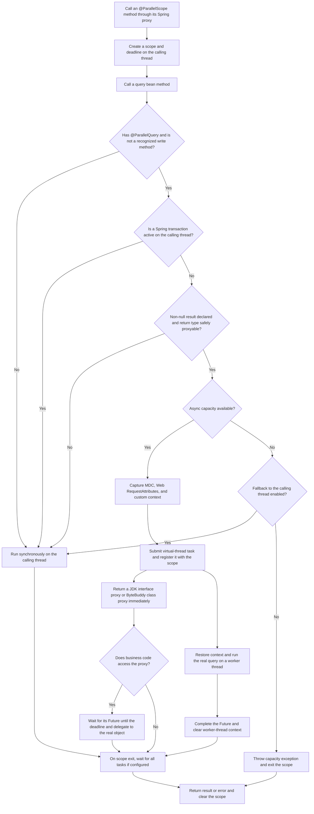

# Parallel Query Starter

[简体中文](README.zh-CN.md)

## Overview

Parallel Query Starter is an open-source Spring Boot library for query aggregation. It uses Spring AOP, Java 21 virtual threads, and lazy result proxies to overlap **independent, read-only queries whose results are guaranteed to be non-null and do not depend on a transaction bound to the calling thread**.

## Supported versions

| Component | Version |
| --- | --- |
| Project source | `1.0.0` |
| JDK | 21 required; later versions are not verified |
| Spring Boot | 3.5.16 verified; other versions, including Boot 4, are not verified |

[Spring Boot 3.5 has reached the end of open-source support](https://spring.io/blog/2026/06/25/spring-boot-3-5-16-available-now/). JDK 8 and 17 cannot run this starter because it uses Java 21 virtual threads. Validate other JDK and Spring Boot combinations in your application.

## Usage

With JDK 21, run `mvn install` in this source checkout to build it into your local Maven repository. Then add the locally built module to your Spring Boot application's `pom.xml`:

```xml
<dependency>
    <groupId>com.parallel</groupId>
    <artifactId>parallel-query-starter</artifactId>
    <version>1.0.0</version>
</dependency>
```

Add `@ParallelScope` to the aggregation method and `@ParallelQuery(nonNullResult = true)` to each query method or type **only when its result is guaranteed to be non-null**:

```java
public interface OrderMapper {
    @ParallelQuery(nonNullResult = true)
    Order selectRequiredOrder(Long id);
}

@Service
public class OrderService {
    private final OrderMapper orderMapper;
    private final UserMapper userMapper;

    public OrderService(OrderMapper orderMapper, UserMapper userMapper) {
        this.orderMapper = orderMapper;
        this.userMapper = userMapper;
    }

    @ParallelScope
    public OrderDetail load(Long orderId, Long userId) {
        Order order = orderMapper.selectRequiredOrder(orderId);
        User user = userMapper.selectRequiredUser(userId); // This method also needs nonNullResult = true
        return new OrderDetail(order, user);
    }
}
```

For a runnable example with database setup, a real Mapper, and transaction fallback, see [MyBatisIntegrationTest.java](src/test/java/com/parallel/integration/MyBatisIntegrationTest.java).

`@ParallelQuery` can be placed on a query method, class, or interface; a type-level annotation applies to its methods. **Prefer annotating individual methods** after confirming that they are read-only. A type-level annotation may include write methods whose names the library cannot recognize. A method that may return `null` can override a type-level annotation with its own `@ParallelQuery`. `nonNullResult=true` is a contract made by the caller: if the query actually returns `null`, the library throws `ParallelQueryException`. Do not enable it indiscriminately on methods such as `selectById` that may return `null`.

Queries without `nonNullResult=true` run synchronously on the calling thread, preserving the meaning of `result == null`. Adding `@ParallelScope` alone does **not** make every Mapper query parallel. With a non-null contract, interface return types such as `List` can use a JDK dynamic proxy. Arrays, sealed or `final` classes, non-public classes, classes with non-overridable `final` or package-private instance methods, and other types that cannot be proxied safely run synchronously.

## Execution flow



Accessing a previous query's proxy waits for that query and creates a data dependency. For example, `user.getId()` waits for the `user` query before a query that needs the ID can be submitted. Independent queries written after that access also start later. Submit independent queries before accessing a proxy to let them overlap.

## Transactions and result semantics

- Spring transactions and JPA persistence contexts are bound to threads. A query remains synchronous when an actual transaction is active on the calling thread. Do not assume worker threads share that transaction. Parallel queries outside a transaction may observe different database snapshots.
- An Advisor recognizes `@ParallelQuery` on interfaces. Methods without the annotation are not intercepted by the query aspect. Recognized write-method prefixes run synchronously; users must ensure that other explicitly annotated methods are read-only and thread-safe.
- `@ParallelScope` and `@ParallelQuery` depend on Spring proxies. Calling an annotated method on the same object through `this` bypasses the aspect; invoke it through a proxy from another bean.
- By default, scope exit waits for every task, and an unconsumed task failure propagates to the caller. A timeout requests cancellation and interrupts the task, but whether a database driver or RPC client responds to interruption depends on that component. Configure I/O timeouts as well.
- Each application instance runs at most `parallel.max-concurrent-queries` asynchronous queries at once. When a call through `@ParallelQuery` reaches that limit, it runs synchronously on the calling thread and returns the real result by default. Set `parallel.fallback-to-caller-on-capacity=false` to throw `ParallelCapacityException` instead. The lower-level `ParallelExecutor.submit(...)` always rejects a submission when capacity is exhausted. This limit applies only to asynchronous queries; caller-thread fallbacks still reach downstream services. Set it according to your connection pool and downstream capacity, and monitor latency.
- `awaitAllOnExit=false` lets proxies and tasks outlive the scope method. Use it only when the caller can handle deferred failures and lifecycle concerns.
- A proxy has a different runtime class: `value.getClass()` returns the proxy class, and `instanceof` checks against a real result subtype may differ from synchronous execution. Class proxies intercept only overridable methods. Direct or reflective field access and field-based serialization may see uninitialized proxy fields. Conventional Jackson getter serialization has a regression test; validate other serializers in your application. If your code depends on these behaviors, run the query synchronously or obtain the real object with `LazyProxyFactory.unwrap(value)`.
- A query fails if context capture, restoration, or cleanup fails, preventing execution without required tenant or authorization context. A custom `ContextPropagator` should modify only the current thread's context.
- Web `RequestAttributes` propagation shares the same object reference. Do not modify request attributes from concurrent queries. With `awaitAllOnExit=false`, also ensure background tasks do not access them after the HTTP request ends.

## Configuration

```yaml
parallel:
  enabled: true
  default-timeout-ms: 5000
  max-concurrent-queries: 64
  fallback-to-caller-on-capacity: true
  shutdown-timeout-seconds: 10
  propagate-mdc: true
  propagate-request-context: true
```

`@ParallelScope(timeoutMs = ...)` overrides the default scope timeout; otherwise `parallel.default-timeout-ms` is used. `@ParallelQuery(timeoutMs = ...)` can shorten a query timeout but cannot extend the time remaining in the scope. By default, the query timeout starts when the task is submitted.

To propagate another `ThreadLocal`, implement `ContextPropagator` and register it as a Spring bean. Spring Security context and data-source routing context are **not propagated automatically**.

The starter does not override the host application's `spring.aop.proxy-target-class` setting. Spring Boot's AOP auto-configuration determines the proxy type by default.

## Database connection budget

Virtual threads still use physical JDBC connections. `parallel.max-concurrent-queries` is an **async task limit per application instance**, not a database-wide connection limit. The default is 64, while a common Hikari pool default is 10. Excess tasks can wait for a connection and consume their scope deadline. With the default `fallback-to-caller-on-capacity=true`, calls above the async limit also execute on request threads and can contend for the same pool. A timeout or cancellation does not guarantee immediate return of a connection if the driver ignores interruption.

Budget connections across *all replicas and clients* before deployment. For one shared datasource, keep `replicas × maximum-pool-size + other client pools + administrative reserve` below the database's connection limit; include every datasource and service in the real calculation. Set the async limit below the pool size when other queries share the pool. For example, **only if your database budget permits 15 connections per replica**, the following leaves seven pool slots for other work while limiting this starter to eight async queries per instance:

```yaml
spring:
  datasource:
    hikari:
      maximum-pool-size: 15
      connection-timeout: 3000
parallel:
  max-concurrent-queries: 8
  fallback-to-caller-on-capacity: false
```

`false` makes overload fail with `ParallelCapacityException`; handle it at the application boundary or reduce incoming concurrency. It does not limit other SQL or other datasource pools. Configure database query and socket timeouts for the driver in use, and keep the scope timeout consistent with those limits. Before production use, load-test concurrent requests and replicas while monitoring Hikari active/idle/pending connections, database connected/running sessions, capacity rejections, timeouts, and p95/p99 request latency. Parallel reads can also increase database CPU and I/O pressure, and queries outside one transaction can observe different snapshots.

## Test results

On 2026-09-28, `mvn -q -o clean verify` completed successfully with Amazon Corretto 21.0.10 and Spring Boot 3.5.16. Results from the local Surefire reports:

| Test suite | Passed | Failed | Skipped |
| --- | ---: | ---: | ---: |
| Parallel query behavior | 28 | 0 | 0 |
| JDK proxy preference | 1 | 0 | 0 |
| MyBatis and H2 integration | 3 | 0 | 0 |
| **Total** | **32** | **0** | **0** |

Tests cover Spring AOP dispatch, H2 MyBatis reads and transactions, concurrent execution, MDC, JSON serialization, capacity fallback, null results, unproxyable types, timeouts, cancellation, and failure propagation. JPA, RPC clients, real database drivers, and production workloads have not been integration-tested. No fixed speedup is guaranteed.

See [CONTRIBUTING.md](CONTRIBUTING.md) for contributions and [SECURITY.md](SECURITY.md) for security reports.

## License

[Apache License 2.0](LICENSE)
