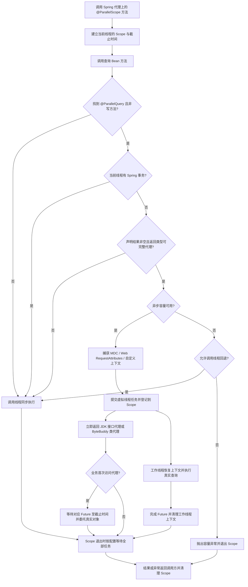
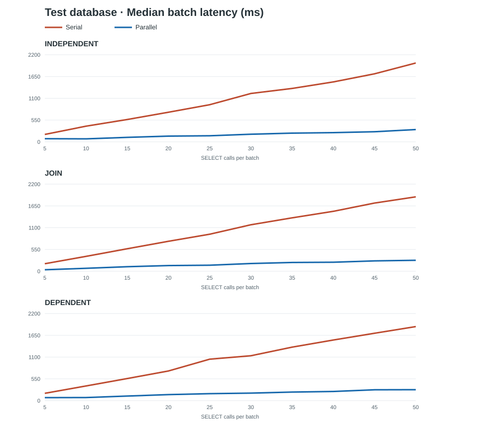
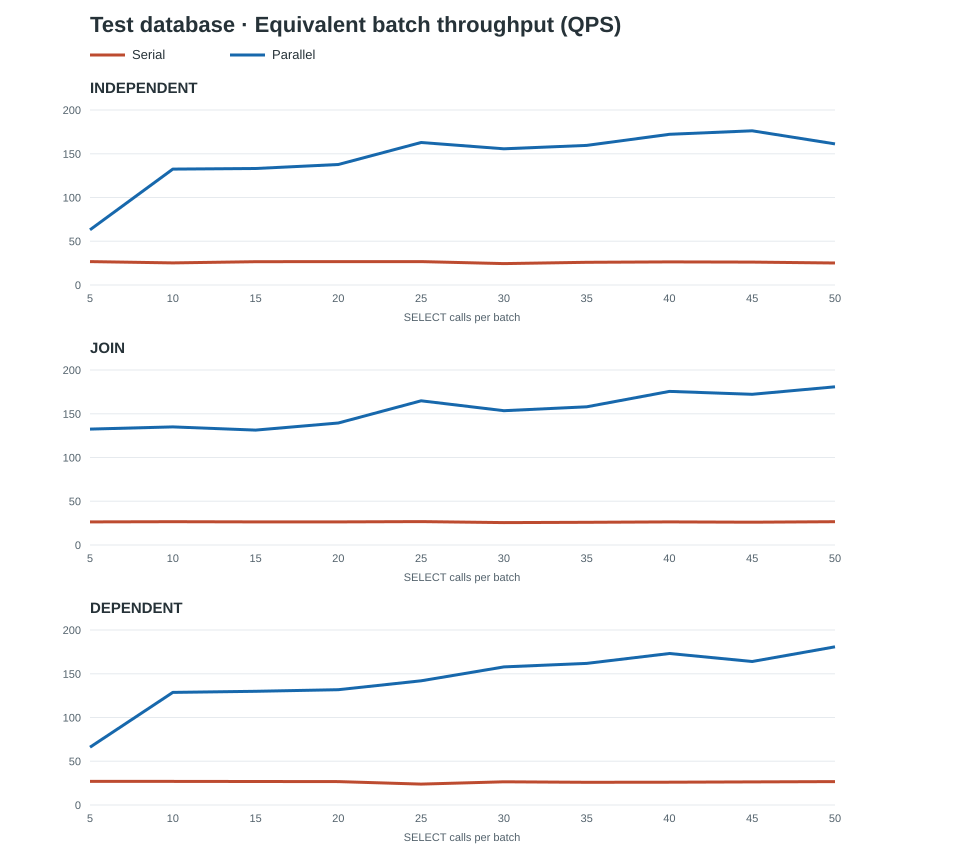

# Parallel Query Starter

[English](README.md)

## 项目简介

Parallel Query Starter 是用于聚合查询的 Spring Boot 开源库。它结合 Spring AOP、Java 21 虚拟线程和延迟结果代理，使**相互独立、结果保证非空、且不依赖调用线程事务**的只读查询重叠执行。

## 支持版本

| 组件 | 版本 |
| --- | --- |
| 项目源码 | `1.0.0` |
| JDK | 最低已验证版本为 21；更高版本尚未验证 |
| Spring Boot | 当前 `1.0.0` JAR 已验证的最低版本为 3.2.3；源码构建基线为 3.5.16 |

[Spring Boot 3.5 已结束开源维护](https://spring.io/blog/2026/06/25/spring-boot-3-5-16-available-now/)。本 Starter 使用 Java 21 虚拟线程，因此 JDK 8 和 17 无法运行。低于 3.2.3 的 Spring Boot 版本、中间的 3.3/3.4 系列及 Boot 4 尚未使用当前 JAR 验证，使用前应在宿主应用中测试。

## 使用方式

在 Spring Boot 应用的 `pom.xml` 中直接添加依赖：

```xml
<dependency>
    <groupId>com.parallel</groupId>
    <artifactId>parallel-query-starter</artifactId>
    <version>1.0.0</version>
</dependency>
```

这种方式要求使用方配置的 Maven 仓库中能解析到 `1.0.0`。也可以自行下载源码，使用 JDK 21 在源码目录执行 `mvn install`；随后同一依赖会从本机 Maven 仓库解析。

在聚合方法上添加 `@ParallelScope`，并在**能保证非空**的查询方法或类上添加 `@ParallelQuery(nonNullResult = true)`：

```java
public interface OrderMapper {
    @ParallelQuery(nonNullResult = true)
    Order selectRequiredOrder(Long id);
}

@Service
public class OrderService {
    private final OrderMapper orderMapper;
    private final UserMapper userMapper;

    public OrderService(OrderMapper orderMapper, UserMapper userMapper) {
        this.orderMapper = orderMapper;
        this.userMapper = userMapper;
    }

    @ParallelScope
    public OrderDetail load(Long orderId, Long userId) {
        Order order = orderMapper.selectRequiredOrder(orderId);
        User user = userMapper.selectRequiredUser(userId); // 此方法也须声明 nonNullResult = true
        return new OrderDetail(order, user);
    }
}
```

包含数据库建表、真实 Mapper 和事务回退的可运行示例见 [MyBatisIntegrationTest.java](src/test/java/com/parallel/integration/MyBatisIntegrationTest.java)。

`@ParallelQuery` 可标在查询方法、类或接口上；类级声明会应用到该类的方法。**推荐逐方法标注**，确认方法只读后再开启并行。类级标注可能覆盖框架无法从名称识别的写方法。需要允许 `null` 的方法可单独标注 `@ParallelQuery` 覆盖类级声明。`nonNullResult=true` 是调用方的契约：若实际返回 `null`，框架抛出 `ParallelQueryException`。不要对可能返回 `null` 的 `selectById` 等方法盲目使用该选项。

未声明 `nonNullResult=true` 的查询在调用线程同步执行，保留 `result == null` 的原有语义。仅添加 `@ParallelScope` **不会**让所有 Mapper 查询并行；这是为保证返回值正确性所做的选择。`List` 等接口返回类型在声明非空后可以使用 JDK 动态代理；数组、密封类、`final` 类、非公开类、含不可覆盖 `final` 或包级可见实例方法的类以及无法安全代理的类型同步执行。

## 实现路径



数据依赖通过访问先前查询的代理来等待。例如 `user.getId()` 会先等待 `user` 查询完成，再提交依赖它的查询；写在该访问之后的独立查询也只能随后启动。把独立查询放在访问代理之前，才能更早并行执行。

## 事务与结果边界

- Spring 事务和 JPA 持久化上下文绑定线程。调用线程已有实际事务时，查询保持同步；不要假设工作线程与调用线程共享事务。事务外的并行查询可能各自取得不同时间点的数据快照。
- 接口上的 `@ParallelQuery` 由 Advisor 识别；未标注方法不会被查询切面拦截。写方法前缀被同步放行；其他显式标注的方法须由使用者保证只读与线程安全。
- `@ParallelScope` 和 `@ParallelQuery` 依赖 Spring 代理。同一对象通过 `this` 调用自己的注解方法不会触发切面；应从另一个 Bean 调用代理上的方法。
- 默认在作用域退出时等待全部任务；未消费任务失败也会向调用方抛出异常。超时会请求取消并中断运行任务，但底层数据库驱动或 RPC 客户端是否响应中断，取决于其自身实现；还应配置相应的 I/O 超时。
- 每个应用实例最多同时执行 `parallel.max-concurrent-queries` 个异步查询。经 `@ParallelQuery` 发起的调用达到上限时，默认在调用线程同步执行并直接返回真实结果；设置 `parallel.fallback-to-caller-on-capacity=false` 后抛出 `ParallelCapacityException`。低层 `ParallelExecutor.submit(...)` 在容量耗尽时始终拒绝提交。该上限只限制异步查询，回退到调用线程的查询仍会访问下游，请根据数据库连接池和下游容量设置并监控延迟。
- `awaitAllOnExit=false` 允许代理和任务在作用域方法返回后继续存在。只有确认调用方能处理延迟异常与生命周期问题时才使用。
- 代理是不同的运行时类：`value.getClass()` 返回代理类；对真实结果子类做 `instanceof` 判断也可能与同步查询不同。类代理只拦截可覆盖的方法；直接读字段、反射读字段、按字段序列化等方式可能看到代理未初始化的字段。Jackson 常规 getter 序列化已有回归测试，但其他序列化器仍需在宿主应用中验证。依赖字段访问等行为的业务请同步查询，或先通过 `LazyProxyFactory.unwrap(value)` 取得真实对象。
- 上下文捕获、恢复或清理失败时，查询会失败，避免在缺失租户或权限上下文时继续执行。自定义 `ContextPropagator` 应只操作当前线程的上下文。
- Web `RequestAttributes` 传递的是同一个对象引用，必须避免在并发查询中修改请求属性。使用 `awaitAllOnExit=false` 时，还要确保后台任务不会在 HTTP 请求结束后继续访问它。

## 配置

```yaml
parallel:
  enabled: true
  default-timeout-ms: 5000
  max-concurrent-queries: 64
  fallback-to-caller-on-capacity: true
  shutdown-timeout-seconds: 10
  propagate-mdc: true
  propagate-request-context: true
```

`@ParallelScope(timeoutMs = ...)` 可覆盖默认作用域超时；未设置时使用 `parallel.default-timeout-ms`。`@ParallelQuery(timeoutMs = ...)` 可以缩短单次查询超时，但不会延长作用域的剩余时间。默认情况下超时从任务提交开始计算。

若需传递其他 `ThreadLocal`，实现 `ContextPropagator` 并注册为 Spring Bean。Spring Security 上下文、数据源路由等**不会自动传递**。

Starter 不覆盖宿主应用的 `spring.aop.proxy-target-class` 设置；默认由 Spring Boot 的 AOP 自动配置决定代理类型。

## 数据库连接预算与使用风险

虚拟线程执行 JDBC 查询仍需物理数据库连接。`parallel.max-concurrent-queries` 只限制**单应用实例的异步任务数**，不是数据库全局连接数限制。项目默认值为 64，而常见 Hikari 默认连接池上限为 10；多出的任务可能排队等待连接，耗尽作用域超时时间。默认 `fallback-to-caller-on-capacity=true` 时，超过异步上限的查询仍会在请求线程上执行，并争用同一个连接池。若驱动不响应中断，超时或取消后连接也不一定立即释放。

部署前应核算**全部应用副本和其他客户端**的连接预算。对于一个共享数据源，可用 `副本数 × 每副本连接池上限 + 其他客户端连接池 + 运维预留 < 数据库连接上限` 做初步约束；实际计算还须纳入其他数据源和服务。若业务查询与本工具共用连接池，异步上限宜低于连接池上限。例如，**仅在每副本可分配 15 个连接时**，下面的配置将本工具的异步任务限制为 8 个，并给其他查询留出 7 个池内名额：

```yaml
spring:
  datasource:
    hikari:
      maximum-pool-size: 15
      connection-timeout: 3000
parallel:
  max-concurrent-queries: 8
  fallback-to-caller-on-capacity: false
```

设置为 `false` 后，容量不足会抛出 `ParallelCapacityException`；应用须处理该错误或限制入口并发。这项配置不会限制其他 SQL 或其他数据源连接池。还应为实际使用的数据库驱动配置查询与网络超时，并与 Scope 超时配合。上线前用**并发请求和多副本**做负载测试，观察 Hikari 的活动、空闲、等待连接数，数据库已连接及运行会话，容量拒绝、超时，以及请求 p95/p99 延迟。并行查询还可能增加数据库 CPU 与 I/O 压力；事务外的多次读取也可能看到不同快照。

## 测试结果

### 当前自动化测试

2026-09-28 使用 Amazon Corretto 21.0.10、Spring Boot 3.5.16 执行 `mvn -q -o clean verify`，本地构建通过。Surefire 报告如下：

| 测试组 | 通过 | 失败 | 跳过 |
| --- | ---: | ---: | ---: |
| 并行查询行为 | 28 | 0 | 0 |
| JDK 代理偏好 | 1 | 0 | 0 |
| MyBatis 与 H2 集成 | 3 | 0 | 0 |
| **合计** | **32** | **0** | **0** |

另将当前 `1.0.0` JAR 安装到本机，并作为依赖放入独立的 Spring Boot 3.2.3、JDK 21 消费方项目；相同的 32 个测试通过（失败 0、跳过 0）。因此 3.2.3 是**最低已测试**的 Boot 版本，不代表已证明所有更低版本不可用。

测试覆盖 Spring AOP 调度、H2 上的真实 MyBatis 查询与事务、并行执行、MDC、JSON 序列化、容量回退、空值、不可代理类型、超时、取消及异常传播；尚未集成验证 JPA、RPC 客户端、真实数据库驱动和生产负载。不能保证固定的性能提升比例。

### 历史测试库基准报告

独立的**测试库**基准于 2026-09-28 使用 JDK 21.0.10、Spring Boot 3.2.3 和本项目较早的 `1.0.0-SNAPSHOT` 源码运行。环境为单应用实例、MySQL 连接池上限 8、异步任务上限 50；每档先预热 1 对，再测量 3 对串行与并行批次，并校验结果。分别对 5、10、……、50 次 `SELECT` 测量独立查询、关系关联查询及前后依赖的两阶段查询。下表列出首尾两档；图表和 [CSV 数据](docs/benchmarks/test-db-2026-09-28.csv)包含全部档位。

| 模式 | 查询次数 | 串行耗时中位数 | 并行耗时中位数 | 加速比 | 串行批次等效 QPS | 并行批次等效 QPS |
| --- | ---: | ---: | ---: | ---: | ---: | ---: |
| 独立查询 | 5 | 187.3 ms | 79.3 ms | 2.36× | 26.7 | 63.1 |
| 独立查询 | 50 | 1,991.3 ms | 310.0 ms | 6.42× | 25.1 | 161.3 |
| 关联查询 | 5 | 189.6 ms | 37.7 ms | 5.03× | 26.4 | 132.5 |
| 关联查询 | 50 | 1,879.4 ms | 276.5 ms | 6.80× | 26.6 | 180.8 |
| 依赖查询 | 5 | 185.1 ms | 75.7 ms | 2.44× | 27.0 | 66.0 |
| 依赖查询 | 50 | 1,870.2 ms | 276.6 ms | 6.76× | 26.7 | 180.8 |





等效 QPS 按“查询次数 ÷ 批次耗时中位数”计算，**不是并发请求下的持续吞吐量**。测试时异步上限高于连接池大小，不可作为生产配置。以上数字来自较早的 Snapshot，不能作为当前 `1.0.0` 源码的性能证明。网络、缓存、索引和数据库负载都会影响结果；实际使用前应针对自己的测试库与连接预算验证。

项目的贡献与安全问题报告方式分别见 [CONTRIBUTING.md](CONTRIBUTING.md) 和 [SECURITY.md](SECURITY.md)。

## 许可证

[Apache License 2.0](LICENSE)
